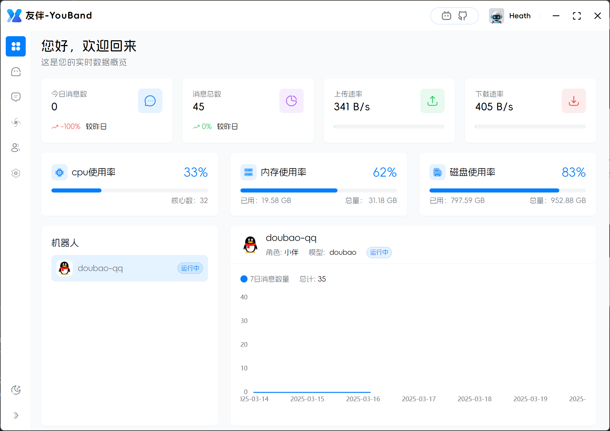

  

<h1>友伴-YouBand</h1>

一款轻量、易用、跨平台的"LLM聊天机器人"桌面程序

# 🤖 项目介绍

`友伴(YouBand)`是一款`轻量、易用、跨平台`的`"LLM聊天机器人"`
桌面程序。支持QQ、微信、飞书等应用，可自由切换DeepSeek、Ollama、Qwen等大模型。让您的应用成为24小时待命的私人助理，用AI重新定义您的工作效率与生活体验。

# 🎉 项目安装

请根据操作系统类型、版本及架构从[releases](https://github.com/YouBand/YouBand-Mini/releases)页面下载对应桌面程序安装包并完成安装。

# 🪐 开发环境

## node环境安装

开发使用的node版本为`v20.12.2`，npm版本为`10.5.0`。多个node可以使用`nvm`来进行管理。

## tauri环境安装

tauri需要安装rust等相关环境，tauri安装引导地址：`https://v1.tauri.app/v1/guides/getting-started/prerequisites` 。

## 项目运行

进入项目目录，使用该命令: `npm run tauri dev` 来运行项目。如果发现相关依赖下载慢，npm和rust都可以`配置国内下载源`。

## 项目打包

进入项目目录，使用该命令: `npm run tauri build` 来打包项目。列：在window上打包，会生成一个`msi/nsis`
文件，对应在`\src-tauri\target\release\bundle\`目录下。

# 🚀 功能路线

| 功能分类     | 功能描述                         | 状态     |
|----------|------------------------------|--------|
| **消息平台** | QQ(napcat)                   | ✅ 已完成  |
|          | 微信(gewechat)                 | 🚧 进行中 |
|          | 飞书                           | 🚧 计划内 |
|          | 钉钉	                          | 🚧 计划内 |
|          | QQ(官方机器人接口)                  | 🚧 计划内 |
|          | 微信(开放平台)                     | 🚧 计划内 |
|          | 小智                           | 🚧 计划内 |
|          | 小伴(友伴硬件机器人)                  | 🚧 计划内 |
|          | 小艾音响                         | 🚧 计划内 |
|          | 其他常见平台(待添加)                  | 🚧 计划内 |
| **服务平台** | deepseek                     | ✅ 已完成  |
|          | ollama                       | ✅ 已完成  |
|          | 通义千问                         | ✅ 已完成  |
|          | 火山引擎                         | ✅ 已完成  |
|          | dify                         | 🚧 计划内 |
|          | Whisper                      | 🚧 计划内 |
|          | 其他常见平台(待添加)                  | 🚧 计划内 |
| **其他**   | function calling             | 🚧 计划内 |
|          | mcp                          | 🚧 计划内 |
|          | 角色广场(分享自己的角色)                | 🚧 计划内 |
|          | 插件中心(管理mcp/function calling) | 🚧 计划内 |

# ❤️ 开源贡献

期待与每一位朋友的issues/pr🍭！您的每一次提议都将成为项目进化的重要基因🧬。新功能或提案请先在issue播种创意🌱 ，待社区灌溉滋养后共同培育发芽！

# 🌟支持

您的每一个start⭐或赞赏💖，都是我们不断前进的动力🛸。

# 🖼️ 项目预览

  

  

  

  

  

# ⚖️ License

本项目遵循AGPL-v3开源协议授权发布，使用者须遵守其传染性开源条款及版权约束。
友伴(YouBand)接入的微信(Gewechat)、QQ(Napcat)等平台仅保障连接功能，如发生账户风险控制，本项目作者不承担任何责任。建议使用备用账号进行测试。
用户须严格遵守所在地法律法规及平台政策，若因违规操作导致账号封禁、法律纠纷等后果，由用户及第三方教程提供者自行承担，本项目不对此负责。